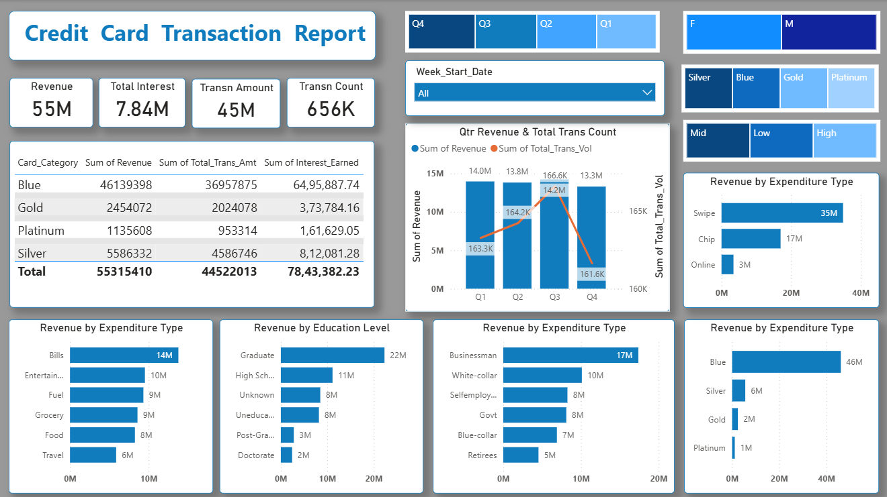
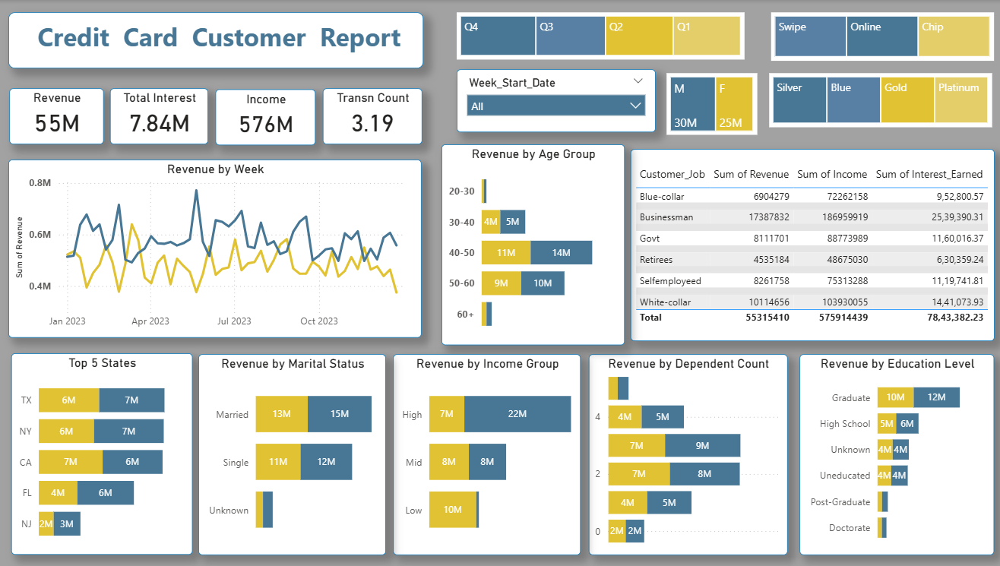

# 💳 Credit Card Customer & Transaction Analytics

## 📊 Project Overview

This project is an interactive **Power BI dashboard** developed to analyze credit card transactions and customer information.

The dashboard provides an overview of transaction performance, revenue, interest earned, customer characteristics, spending behavior, and customer satisfaction.

The report is divided into two main analytical sections:

- **Credit Card Transaction Analysis**
- **Customer Analysis**

---

## 🎯 Project Objective

The objective of this project is to explore credit card transaction and customer data and identify meaningful patterns across:

- Revenue and transaction performance
- Transaction amount and transaction volume
- Interest earned
- Card categories
- Expenditure types
- Customer demographics
- Income groups
- Customer occupation
- Education
- Age groups
- Marital status
- Geographic distribution
- Customer satisfaction

The dashboard allows users to interact with the data using filters and explore different customer and transaction segments.

---

## 🛠️ Tools Used

- **Microsoft Power BI**
- **Power BI Visualizations**
- **Data Analysis**
- **Interactive Dashboard Design**

---

## 📈 Dashboard Overview

### 1. Credit Card Transaction Analysis

The transaction analysis page provides an overview of credit card performance through key financial and transaction metrics.

The analysis includes:

- Revenue
- Interest Earned
- Total Transaction Amount
- Total Transaction Volume
- Card Category
- Expenditure Type
- Transaction Trends
- Customer-related Transaction Breakdowns

The page uses interactive visualizations such as KPI cards, charts, treemaps, tables, and filters to explore transaction patterns.

### 2. Customer Report

The customer analysis page focuses on understanding customer characteristics and behavior.

The analysis includes:

- Revenue
- Interest Earned
- Income
- Customer Satisfaction Score
- Customer Job
- Education
- Gender
- Age Group
- Income Group
- Marital Status
- State
- Customer Spending and Transaction-related Information

This allows users to explore how customer characteristics relate to credit card performance and behavior.

---

## 🔑 Key Performance Indicators

The dashboard tracks important metrics including:

| KPI | Description |
|---|---|
| **Revenue** | Revenue generated through credit card activity |
| **Interest Earned** | Interest generated from credit card activity |
| **Total Transaction Amount** | Overall value of transactions |
| **Total Transaction Volume** | Overall transaction volume |
| **Income** | Customer income information |
| **Customer Satisfaction Score** | Measure of customer satisfaction |

---

## 📊 Dashboard Features

The Power BI report includes:

- Interactive KPI cards
- Bar and column charts
- Treemap visualizations
- Tables
- Interactive filters and slicers
- Customer segmentation
- Transaction analysis
- Demographic analysis
- Trend analysis
- Comparative analysis

---

## 📷 Dashboard Preview

### Credit Card Transaction Analysis



### Customer Report



---

## 💡 Key Insights

The dashboard was created to identify patterns in credit card transactions and customer behavior.

The analysis can be used to understand:

- Which card categories contribute to transaction performance
- How expenditure types vary across customers
- How revenue and transaction activity change across different segments
- How customer demographics differ across income, age, education, occupation, and marital-status groups
- How customer satisfaction varies across the customer base
- How transaction and revenue metrics can be explored across different customer segments


---

## 📁 Project Structure

```text
credit-card-customer-analytics/
│
├── dashboard/
│   └── Credit_Card_Customer_Analytics.pbix
│
├── screenshots/
│   ├── credit-card-transactions.png
│   └── customer-report.png
│
└── README.md

```
## 🎯 Business Value

This project demonstrates the use of Power BI to transform credit card transaction and customer data into an interactive analytical dashboard.

The dashboard can help stakeholders explore transaction performance, understand customer characteristics, identify spending patterns, and evaluate customer satisfaction through interactive data visualization.

---

## 👤 About Me

**Salvia Ronald Dsouza**

Aspiring Data Analyst with a background in Computer Applications and experience working with data visualization and analytical tools.

**Skills:** Power BI • SQL • Excel • Python • Tableau

🔗 [GitHub](https://github.com/Salvia19)
